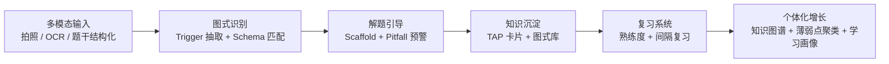

<div align="center">

# TAP

An AI-native mistake notebook prototype for Gaokao math learning.

</div>

一个面向高中数学场景的 AI-native 错题本前端交互原型。

它不是把错题“存起来”这么简单，而是试图把每道错题沉淀成可复用的思维图式。当前原型聚焦高考数学，围绕 `TAP` 方法展开：

- `T = Trigger`：题目里触发某个模型的关键词或结构特征
- `A = Action`：识别到图式后，应该立即执行的标准思维动作
- `P = Pitfall`：这类题最容易掉进去的坑

## English Summary

TAP is a frontend interaction prototype for an AI-native mistake notebook focused on high school math, especially Gaokao-style problem solving.

Instead of treating mistakes as isolated records, TAP tries to turn each mistake into a reusable thinking schema:

- `Trigger`: the signal in the problem that should activate a known pattern
- `Action`: the standard reasoning move the student should execute next
- `Pitfall`: the common mistake to avoid in that pattern

The current repository is a single-page React prototype powered by local mock data. It validates product narrative, information architecture, and core interaction flow, but does not yet include real OCR, LLM reasoning, persistence, or backend services.

## 项目定位

这个项目想验证一件事：

> 错题本的核心价值，不应该只是“回看答案”，而应该是帮助学生把错误转化成稳定的识别模式与解题反射。

相比传统错题本，这个原型更关注：

- 从“题目订正”转向“图式提取”
- 从“记住这道题”转向“识别这一类题”
- 从“看解析”转向“AI 引导下的思维脚手架”
- 从“单题记录”转向“错题本 + 图式库 + 关联知识图谱”

当前版本是一个前端交互 POC，重点验证产品叙事、信息架构和关键界面流，不代表完整可用产品。

## 当前原型包含什么

- `首页 / Hero`：解释产品理念，强调高频题型的标准化模型识别
- `拍题入口`：模拟拍题触发与扫描过程
- `Schema 识别`：在题干中高亮 Trigger，要求用户匹配正确思维模型
- `Scaffold 解题`：按步骤推进思维动作，并在关键节点插入 Pitfall 提醒
- `TAP 卡片生成`：将本题沉淀为一张可复习的 Trigger / Action / Pitfall 卡片
- `图式关联`：通过知识图谱视图展示变式题和概念扩展
- `错题本`：以状态和标签组织错题记录
- `图式模型库`：以类别、熟练度、上次复习时间查看已沉淀模型
- `深度展开页`：查看变式训练、概念解释、定义域等易错提醒

## 界面导览

| 模块 | 目的 | 当前实现 |
| --- | --- | --- |
| Home | 用一句话建立产品心智 | Hero 区、错题本入口、图式库入口、最近 Pitfall |
| Camera | 建立“拍题即分析”的入口感 | 拍题扫描 mock，强调移动端使用场景 |
| Analysis | 把题干中的触发信号显性化 | 高亮 Trigger，选择正确 Schema |
| Scaffold | 从“答案讲解”切换到“思维引导” | 逐步推进步骤，关键节点插入易错警示 |
| TAP Card | 沉淀复习资产 | 输出 Trigger / Action / Pitfall 卡片 |
| Knowledge Graph | 把单题扩展成知识网络 | 变式、概念、定义域陷阱等深链内容 |
| Mistake Notebook | 管理错题状态 | 按复习中 / 已掌握筛选 |
| Schema Library | 管理长期思维模型 | 按学科类别与掌握度浏览 |

## 典型交互流

```text
首页
  -> 拍题
  -> 识别题干中的 Trigger
  -> 匹配正确 Schema
  -> 跟随思维脚手架完成解题
  -> 生成 TAP 卡片
  -> 进入变式 / 概念关联
  -> 回流到错题本与图式库
```

## 架构说明

### 1. 当前仓库架构：前端交互原型

当前实现是一个单页 React 原型，使用本地 mock 数据驱动，不依赖后端服务。

- `App.tsx`：负责整个原型的 screen state 切换与主流程编排
- `components/`：按页面与交互模块拆分的展示层组件
- `constants.ts`：题目、错题、图式模型等 mock 数据
- `types.ts`：TAP、题目、Step、Pitfall、Schema 等领域模型
- `metadata.json`：原型元信息
- `vite.config.ts` / `index.html`：本地开发与打包入口

目录结构如下：

```text
.
├── App.tsx
├── components/
│   ├── AnalysisView.tsx
│   ├── CameraMock.tsx
│   ├── MistakeNotebook.tsx
│   ├── ScaffoldSolver.tsx
│   ├── SchemaDeepDive.tsx
│   ├── SchemaLibrary.tsx
│   └── TapCard.tsx
├── constants.ts
├── index.html
├── index.tsx
├── metadata.json
├── types.ts
└── vite.config.ts
```

### 2. 目标产品架构：AI-native 错题本

如果继续往产品化推进，比较自然的架构会是：



也就是说，这个仓库现在验证的是最前面的“交互容器”和“信息呈现方式”，真实的 OCR、LLM 推理、用户画像、复习调度还没有接入。

## 设计原则

- 先识别，再讲解：把“这是什么题型”放在“怎么做”之前
- 先动作，再结论：优先教学生触发什么思维动作，而不是只给最终答案
- 错误要可复用：每道错题都应该沉淀成未来可调用的 TAP 卡片
- 单题要能扩展：从一道题自然延伸到变式题、关联概念和典型陷阱
- 原型优先验证叙事：当前版本先验证交互与产品方向，而不是追求工程完备性

## 技术栈

- React 19
- TypeScript
- Vite 6
- `lucide-react`
- Tailwind CSS CDN（通过 `index.html` 注入，当前未引入本地 Tailwind 工程化配置）

## 快速开始

### 环境要求

- Node.js 18 或更高版本
- npm

### 本地运行

```bash
npm install
npm run dev
```

默认开发地址由 Vite 提供，当前配置监听 `0.0.0.0:3000`。

### 构建生产包

```bash
npm run build
npm run preview
```

说明：

- 当前原型不需要配置环境变量即可运行
- 仓库中虽然保留了 `GEMINI_API_KEY` 的 Vite 注入配置，但目前前端原型并未真正消费该能力

## 仓库阅读顺序

如果你第一次进入这个仓库，建议按这个顺序看：

1. `README.md`：先理解产品假设与范围
2. `App.tsx`：看主流程状态切换
3. `types.ts`：看 TAP、Problem、Step、Pitfall 等核心模型
4. `constants.ts`：看原型目前如何用 mock 数据表达题目与图式
5. `components/`：按页面逐个理解交互细节

## 当前范围与限制

为了避免误解，这里明确一下当前版本不包含的能力：

- 没有真实拍照、OCR、题目解析服务
- 没有真正的 LLM 图式抽取或推理链路
- 没有用户登录、数据持久化或后端 API
- 没有真实复习调度、掌握度计算或学习画像
- 当前数据全部来自本地 mock

因此更准确的说法是：

> 这是一个“AI-native 错题本”的前端交互原型，而不是完整产品。

## 适合谁看这个仓库

- 在做 AI 教育产品定义的人
- 在设计错题本 / 练习反馈 / 学习图谱的人
- 想讨论“从题解到思维模型沉淀”这条路径的人
- 想快速复用一个教育产品移动端原型壳的人

## 下一步建议

如果要把这个原型推进成可验证的 MVP，优先级可以是：

1. 接入真实题目输入链路：拍照、OCR、题干结构化
2. 建立 Schema 抽取服务：把题目映射到 Trigger / Action / Pitfall
3. 把错题与图式从 mock 数据升级为可持久化数据模型
4. 增加复习调度与掌握度更新机制
5. 用真实学生题目做图式库冷启动与聚类验证

## 项目状态

实验性原型，当前重点是：

- 验证产品叙事是否成立
- 验证信息架构是否顺滑
- 验证“错题 -> 图式 -> 复习资产”这条路径是否足够清晰

如果你要把它当作正式工程继续开发，建议下一步补齐：

- 真实数据源
- 服务端接口
- 路由与状态管理
- 测试与文档体系
- 设计资产或截图

